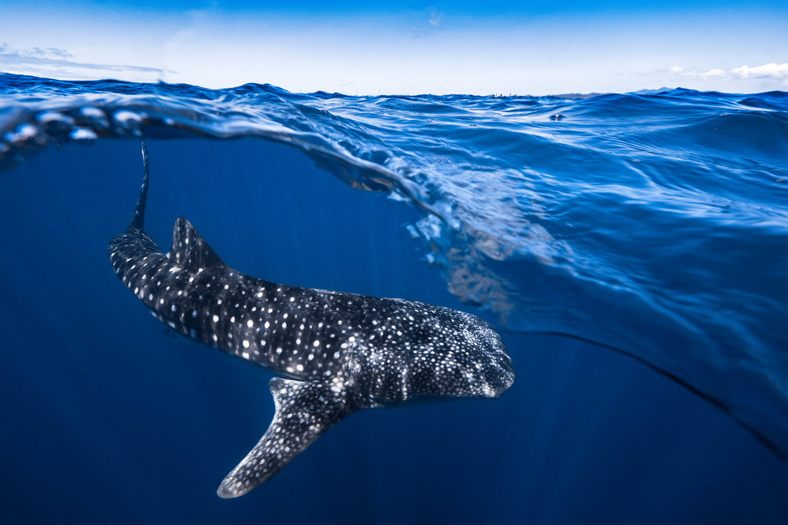

# Tutorial Aims:
We are using `<a href="#section_number">text</a>` to create anchors within our text. For example, when you click on section one, the page will automatically go to where you have put `<a name="section_number"></a>`.

If you want to make text bold, you can surround it with `__text__`, which creates __text__. For italics, use only one understore around the text, e.g. `_text_`, _text_.


#### <a href="#section1"> 1. Learning the basics of Species Distribution Modelling (SDM) </a>

#### <a href="#section2"> 2. Creating maps visualizing current and future distributions


## Whale-come to Spatial Data and Maps part II!
 _Whale Sharks are the Gentle Giants of the Sea. Source: [Barathieu, 2020](https://www.underwater-landscape.com/en/-/galeries/best-of/-/medias/9691375e-c115-44c0-a988-5028234eddac-whale-shark-in-split-level)_

### What is Species Distribution Modelling?

---------------------------
Hello everyone! Today we will be building off this [tutorial](https://ourcodingclub.github.io/tutorials/maps/#map_data) which has introduced us to spatial data and creating informative maps. It is recommended to have done part I of this tutorial before starting on this one, and if you need a refresher feel free to take a look before we start! Cool, so now that we've dipped our toes into plotting species occurrence points onto maps, perhaps we can set our sights on a broader horizon- modelling species distributions for conservation and management purposes.

 Here's where Species Distribution Models (SDMs) come in! They've gained popularity due to their ease of use and low data requirements. Beyond visualizing species distributions, SDMs can help us explore the patterns and processes behind the observed distribution of species. Thus, SDMs can be used to predict and project shifts in a species' potential future geographic range, encompassing both seasonal and temporal variability- no crystal gazing required! Let's quickly break it down. Species Distribution Modelling typically encompasses 5 main steps (1) conceptualization, (2) data preparation, (3) model fitting, (4) model assessment, and (5) prediction (Figure 1).


 Given the global climate change and subsequent changes in environmental predictors such as the above, how might a species' distributions shift? Building an SDM requires mindful consideration of specific predictors driving the variability in species occurrence.
  Since multiple studies have related whale shark presences with chlorophyll concentrations (as a proxy for prey abundance) as well as sea surface temperature (SST) between the range of ..., we shall pick these drivers as our environmental predictors. For our tutorial, we will be thus be incorporating whale shark occurrence data with chlorophyll and SST data to create interactive maps visualizing their current and future distributions.  All the data required for this tutorial can be accessed [here](https://github.com/EdDataScienceEES/tutorial-nicolelikesharks/tree/master/Data) from <a href="https://github.com/EdDataScienceEES/tutorial-nicolelikesharks" target="_blank">this GitHub repository</a>. Clone and download the repo as a zip file, then unzip it into your desired folder.

 # Index:

 Whew! That was a lot. Not to worry, here is a quick breakdown of what we will be covering today.

 #### <a href="#section1"> 1. Downloading data </a>

 #### <a href="#section2"> 2. Data Preparation: Tidying and formatting data using `tidyverse`</a>


 #### <a href="#section3"> 3. Creating basic maps using occurrence data and environmental data using `ggplot2` </a>

 #### <a href="#section4"> 4. Creating interactive bubble maps using `leaflet`!  </a>

 We won't be completing the full 5-step process of modelling in this tutorial as we just want to ease into the process by quickly visualizing the potential relationships between whale shark presences with chlorophyll and SST. Bummer, I know! That being said, there is so much to species distribution modelling, we can explore the statistics behind those relationships, plot even more informative species range predictions and more! So if you're intrigued (and of course you are ;) take a look at some [useful resources](https://github.com/EdDataScienceEES/tutorial-nicolelikesharks/tree/master/Useful%20resources) that go in depth, and keep an eye out for our future tutorials that will take a deeper dive into the species distribution modelling.


<a href="#section1"></a>
## 1. Downloading data

 It might seem daunting to find datasets in the huge realm we call the internet, but thanks to open source databases such as [GBIF] (https://www.gbif.org/) and [OBIS (https://obis.org/), we can easily download the species occurence data we need. In this tutorial we've already downloaded the [whale shark occurrence dataset]() in this [GitHub folder](). As for our environmental predictor data, we've also downloaded them from Bio-ORACLE [here]().

First, open `RStudio`, create a new script by clicking on `File/ New File/ R Script`. If you are unfamiliar with `RStudio` and don't know where to start, this introductory [tutorial](https://ourcodingclub.github.io/tutorials/intro-to-r/index.html) might help! Next set the working directory like so:

```r
 # Set the working directory (this is just an example, replace with your own file path)
setwd("C:/Users/nicol/Documents/Data Science Course/tutorial-nicolelikesharks)
```
(Tip for Windows users: If you copy and paste a filepath from Windows Explorer into RStudio, it will appear with backslashes (\ ), but since R requires all filepaths to be written using forward-slashes (/) remember to change those). Next, load the following packages below using `library()`. If you don't have them installed, type `install.packages"package_name"` to install them before loading them.

```
# Libraries----

library(tidyr)
library(dplyr)
library(leaflet) # For creating our interactive maps
library(htmlwidgets)
library(sdmpredictors) # Package for all our SDM needs
library(sp)
library(sf)
library(rgdal)
library(raster)
library(ggplot2) # For creating maps
library(ggthemes) # For choosing our map theme
library(viridis) # Colour palette that colour-blind friendly
library(rasterVis)
library(maps)
library(rworldmap)
library(maptools)

```

<a href="#section2"></a>
## 2. Data Preparation: Tidying and formatting data


```r
# Loading and preparing data----

whale_sharks <- read.csv("Data/whale_sharks_ningaloo.csv")

# Inspect whale shark occurence data

head(whale_sharks)

# Checking to see how many rows and columns there are

dim(whale_sharks)

# Viewing column names

colnames(whale_sharks)


# Only keeping columns we need

whale_sharks_latlong <- subset(whale_sharks, select=c(oid,latitude,longitude,num_animals))
whale_sharks_latlong2 <- subset(whale_sharks, select=c(longitude,latitude))

```

Now we will load our `.tif` files for sea surface temperature (SST) and chlorophyll minimum concentrations accessed from [Bio-ORACLE](https://www.bio-oracle.org/downloads-to-email.php). Bio-ORACLE has future layers for all sorts of predictors (e.g salinity, ice thickness etc.) till 2100!

```
# Loading sea surface temperature range and chlorophyll minimum rasters

temp_raster <- raster("Data/surface_temp.tif")
chl_raster <- raster("Data/chl_min.tif")
```


I know we're all itching to get started on mapping, so let's plot our preliminary whale shark occurrence points!

```
# Preliminary visualization----

# Plot basic whale shark occurence points

(prelim_plot <- ggplot(whale_sharks_latlong, aes(x = longitude, y = latitude,
                                                 colour = num_animals)) +
    geom_point())

```
Looks good! For now... Let's see what they look like with the map for Australia. First let's get our map data:

```

# Obtaining map data

world <- getMap(resolution = "low")
world_aus <- world[world@data$ADMIN=='Australia',] # Getting map for Australia


# Plotting points on australia map

(whale_sharks_map <- ggplot() +
    borders("world", xlim = c(113, 154), ylim = c(-44, -10),
            colour = "gray40", fill = "gray75", size = 0.3) +
    geom_polygon(data = world_aus,
                 aes(x = long, y = lat, group = group),
                 fill = NA, colour = "blue") +
    geom_point(data = whale_sharks_latlong,  # Add and plot species data
               aes(x = longitude, y = latitude,
                   colour = num_animals)) +
    scale_colour_viridis(option = "inferno") +
    coord_quickmap() +  # Prevents stretching when resizing
    theme_map() +  # Remove ugly grey background
    xlab("Longitude") +
    ylab("Latitude") +
    guides(colour=guide_legend(title="Number of whale sharks observed")))

		# Save our plot
		ggsave("Output/whale_sharks_map.png") # Saving .png version of map
		ggsave("Output/whale_sharks_map.pdf") # Saving .pdf version of map

```


 Here's what our basic map looks like:

 _Figure 2: Occurrence points on basic map_


Hmmm... can you spot (pun intended!) what might be wrong here? Some occurrence points look like they're on land! Last I checked, whale sharks can't swim on land (they'd all flip out!) so we need to examine and clean our data to resolve this.

<a href="#section3"></a

## 3. Plotting occurrence data points onto predictor maps

## 4. Plotting interactive bubble maps

Now here's the part we've all been waiting for! Let's create our interactive bubble maps! We first create a colour palette with customizable bins. What these are 

```
# Creating interactive bubble map----

# Create a color palette with customizable bins

mybins <- seq(1, 26, by=5)
mypalette <- colorBin( palette="YlOrBr", whale_sharks_latlong$num_animals, na.color="transparent", bins=mybins)

# Prepare the text for the tooltip

mytext <- paste(
    "Longitude: ", whale_sharks_latlong$longitude, "<br/>",
    "Latitude: ", whale_sharks_latlong$latitude, "<br/>",
    "Number of animals: ", whale_sharks_latlong$num_animals, sep="") %>%
    lapply(htmltools::HTML)

# Creating occurrence interactive Map

int_map <- leaflet(whale_sharks_latlong) %>%
    addTiles()  %>%
    setView( lat=-27, lng=170 , zoom=4) %>%
    addProviderTiles("Esri.WorldImagery") %>%
    addCircleMarkers(~longitude, ~latitude,
                     fillColor = ~mypalette(num_animals), fillOpacity = 0.7, color="white", radius=8, stroke=FALSE,
                     label = mytext,
                     labelOptions = labelOptions( style = list("font-weight" = "normal", padding = "3px 8px"), textsize = "13px", direction = "auto")
    ) %>%
    addLegend( pal=mypalette, values=~num_animals, opacity=0.9, title = "Number of animals", position = "bottomright" )

		# Save the widget in a html file

		saveWidget(int_map, file="bubblemap_whalesharks.html")
```

Now go to your folder, click on the `.html` link and view your map. You can hover your mouse over the points and view the latitude, longitude and number of animals observed at each individual point. Pretty neat huh?

Okay, next let's make our interactive maps


Aaaannd that's a wrap! Congratulations, you can now show off your beautiful maps to your friends and family! In this tutorial we learned:

##### - What Species Distribution Modelling is, why and how we use it.
##### - How to create basic maps
##### - How to create interactive maps.

If you're a real keen bean, try choosing your favourite species (I chose mine for this tutorial) and downloading their occurrence and climate datasets. Have a think about the drivers that might influence their future distributions and have a go at creating your very own maps! Next up, we'll properly embark on model fitting, model assessment and finally predictions! Thank you for joining me on this voyage (and putting up with all the bad marine puns!) I hope to _sea_ you at our next tutorial.


<hr>
<hr>

#### Check out our <a href="https://ourcodingclub.github.io/links/" target="_blank">Useful links</a> page where you can find loads of guides and cheatsheets.

#### If you have any questions about completing this tutorial, please contact me at s1761850@ed.ac.uk

#### <a href="INSERT_SURVEY_LINK" target="_blank"> I would love to hear your feedback on the tutorial, feel free to share your experience! </a>

<ul class="social-icons">
	<li>
		<h3>
			<a href="https://twitter.com/our_codingclub" target="_blank">&nbsp;Follow our coding adventures on Twitter! <i class="fa fa-twitter"></i></a>
		</h3>
	</li>
</ul>

### &nbsp;&nbsp;Subscribe to our mailing list:
<div class="container">
	<div class="block">
        <!-- subscribe form start -->
		<div class="form-group">
			<form action="https://getsimpleform.com/messages?form_api_token=de1ba2f2f947822946fb6e835437ec78" method="post">
			<div class="form-group">
				<input type='text' class="form-control" name='Email' placeholder="Email" required/>
			</div>
			<div>
                        	<button class="btn btn-default" type='submit'>Subscribe</button>
                    	</div>
                	</form>
		</div>
	</div>
</div>
