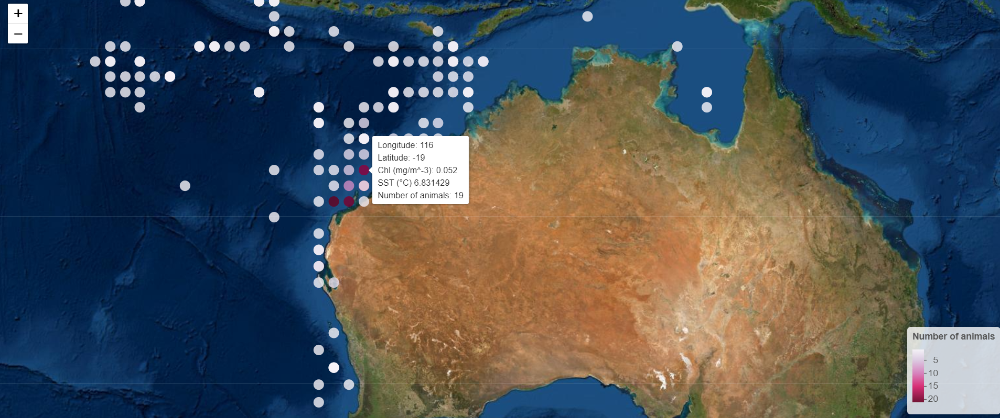

# Spatial data and maps (II)

## Whale-come to Spatial Data and Maps part II!
  

*Whale Sharks are the Gentle Giants of the Sea. Source: [Barathieu, 2020](https://www.underwater-landscape.com/en/-/galeries/best-of/-/medias/9691375e-c115-44c0-a988-5028234eddac-whale-shark-in-split-level)*

### What is Species Distribution Modelling?

---------------------------
Hello everyone! Today we will be building off this [tutorial](https://ourcodingclub.github.io/tutorials/maps/#map_data) which has introduced us to spatial data and creating informative maps. It is recommended to have done part I of this tutorial before starting on this one, and if you need a refresher feel free to take a look before we start! Cool, so now that we've dipped our toes into plotting species occurrence points onto maps, perhaps we can set our sights on a broader horizon- modelling species distributions for conservation and management purposes.

 Here's where Species Distribution Models (SDMs) come in! They've gained popularity due to their ease of use and low data requirements. Beyond visualizing species distributions, SDMs can help us explore the patterns and processes behind the observed distribution of species. Thus, SDMs can be used to predict and project shifts in a species' potential future geographic range, encompassing both seasonal and temporal variability- no crystal gazing required! Let's quickly break it down. Species Distribution Modelling typically encompasses 5 main steps (1) conceptualization, (2) data preparation, (3) model fitting, (4) model assessment, and (5) prediction (Figure 1).


 Given the global climate change and subsequent changes in environmental predictors such as the above, how might a species' distributions shift? Building an SDM requires mindful consideration of specific predictors driving the variability in species occurrence.
  Since multiple studies have related whale shark presences with chlorophyll concentrations (as a proxy for prey abundance) as well as sea surface temperature (SST) between the range of ..., we shall pick these drivers as our environmental predictors. For our tutorial, we will be thus be incorporating whale shark occurrence data with chlorophyll and SST data to create interactive maps visualizing their current and future distributions.  All the data required for this tutorial can be accessed [here](https://github.com/EdDataScienceEES/tutorial-nicolelikesharks/tree/master/Data) from <a href="https://github.com/EdDataScienceEES/tutorial-nicolelikesharks" target="_blank">this GitHub repository</a>. Clone and download the repo as a zip file, then unzip it into your desired folder.

 # Index:

 Whew! That was a lot. Not to worry, here is a quick breakdown of what we will be covering today.

#### <a href="#section1"> 1. Workspace Organisation and Downloading data </a>

#### <a href="#section2"> 2. Data Preparation: Tidying and formatting data using `subset()`</a>

#### <a href="#section3"> 3. Creating basic maps using occurrence data and environmental data using `ggplot2` </a>

#### <a href="#section4"> 4. Creating interactive bubble maps using `leaflet`!  </a>

 We won't be completing the full 5-step process of modelling in this tutorial as we just want to ease into the process by quickly visualizing the potential relationships between whale shark presences with chlorophyll and SST. Bummer, I know! That being said, there is so much to species distribution modelling, we can explore the statistics behind those relationships, plot even more informative species range predictions and more! So if you're intrigued (and of course you are ;) take a look at some [useful resources](https://github.com/EdDataScienceEES/tutorial-nicolelikesharks/tree/master/Useful%20resources) that go in depth, and keep an eye out for our future tutorials that will take a deeper dive into the species distribution modelling.


<a href="#section1"></a>
## 1. Workspace Organisation and Downloading data

 It might seem daunting to find datasets in the huge realm we call the internet, but thanks to open source databases such as [GBIF](https://www.gbif.org/) and [OBIS](https://obis.org/), we can easily download the species occurence data we need. In this tutorial we've already downloaded the [whale shark occurrence dataset](https://github.com/nicolelikesharks/tutorial_SpatialData2/blob/main/whale_sharks_ningaloo.csv) in this open [GitHub folder](https://github.com/nicolelikesharks/tutorial_SpatialData2). As for our environmental predictor data, we've also downloaded them from Bio-ORACLE into the same folder.

First, open `RStudio`, create a new script by clicking on `File/ New File/ R Script`. If you are unfamiliar with `RStudio` and don't know where to start, this introductory [tutorial](https://ourcodingclub.github.io/tutorials/intro-to-r/index.html) might help! Next set the working directory like so:

```r
 # Set the working directory (this is just an example, replace with your own file path)
setwd("C:/Users/nicol/Documents/Data Science Course/tutorial-nicolelikesharks")
```
(Tip for Windows users: If you copy and paste a filepath from Windows Explorer into RStudio, it will appear with backslashes (\ ), but since R requires all filepaths to be written using forward-slashes (/) remember to change those). Next, load the following packages below using `library()`. If you don't have them installed, type `install.packages"package_name"` to install them before loading them.

```
# Libraries----


library(leaflet) # For creating our interactive maps
library(htmlwidgets) # Used to save interactive bubble maps
library(sp) # For working with spatial data
library(raster) # For working with raster data
library(ggplot2) # For creating plots
library(ggthemes) # For choosing our plot theme
library(viridis) # Colour palette that is colour-blind friendly
library(rworldmap) # For getting world map
library(maptools) # Tools for handling spatial objects

```

<a href="#section2"></a>
## 2. Data Preparation: Tidying and formatting data

Let's load and inspect our data. Upon looking at the columns via `colnames()`, it seems like we have quite a number of redundant columns. To streamline the data we're working with, let's only keep the ones we need. We can do so by creating subsets of the original whale shark dataset and using select() to choose the columns we are interested in.

```r
# Loading and preparing data----

whale_sharks <- read.csv("Data/whale_sharks_ningaloo.csv")

# Inspect whale shark occurence data

head(whale_sharks)

# Checking to see how many rows and columns there are

dim(whale_sharks)

# Viewing column names # Seems like there are a fair few columns! Are there any we don't need?

colnames(whale_sharks)


# Only keeping columns we need

whale_sharks_latlong <- subset(whale_sharks, select=c(oid,latitude,longitude,num_animals))
whale_sharks_latlong2 <- subset(whale_sharks, select=c(longitude,latitude))

```

Now we will load our `.tif` files for sea surface temperature (SST) and chlorophyll minimum concentrations accessed from [Bio-ORACLE](https://www.bio-oracle.org/downloads-to-email.php). Bio-ORACLE has future layers for all sorts of predictors (e.g salinity, ice thickness etc.) till 2100! We load the `.tif` files using the raster() function and create new raster layer objects for them both.

```
# Loading sea surface temperature range and chlorophyll minimum rasters

temp_raster <- raster("Data/surface_temp.tif")
chl_raster <- raster("Data/chl_min.tif")
```
Next, we examine and determine the geographic extent of our data. The `max()` and `min()` functions return the maximum and minimum values of the given column respectively. The `ceiling()` and `floor()` functions are used to round the number up and down respectively to the nearest integer.


```
# Determine the geographic extent of our data.

max.lat = ceiling(max(whale_sharks_latlong$latitude))
min.lat = floor(min(whale_sharks_latlong$latitude))
max.lon = ceiling(max(whale_sharks_latlong$longitude))
min.lon = floor(min(whale_sharks_latlong$longitude))
geographic_extent <- extent(x = c(min.lon, max.lon, min.lat, max.lat))

# Add chlorophyll and SST data from rasters to our datapoints

whale_sharks_latlong3 <- whale_sharks_latlong2  # Create copy of dataframe coordinates to be converted to SpatialPoints
coordinates(whale_sharks_latlong3) <- ~longitude+latitude #
whale_sharks_latlong$chl <- extract(chl_raster, whale_sharks_latlong3) # Add chl data from raster to new column
whale_sharks_latlong$temp <- extract(temp_raster, whale_sharks_latlong3) # Add SST data from raster to new column
```
<a href="#section3"></a>

## 3. Plotting occurrence data points onto predictor maps

Okay, I know we're all itching to get started on mapping, so let's plot our preliminary whale shark occurrence points! ggplot2() to the rescue! If you are new to ggplot2(), here is a useful [cheatsheet](https://github.com/EdDataScienceEES/tutorial-nicolelikesharks/blob/master/Useful%20resources/ggplot2_cheatsheet.pdf) to kickstart your data visualization dreams.

```
# Preliminary visualization----

# Load simple world map for later use

data(wrld_simpl)
plot(wrld_simpl, xlim = c(98, 154), ylim = c(-44, -6), axes=TRUE, col="light yellow") # Zooming into region of interest

# Plot basic whale shark occurence points

(prelim_plot <- ggplot(whale_sharks_latlong, aes(x = longitude, y = latitude,
                                                 colour = num_animals)) +
        geom_point())

```
Looks good! For now... Let's see what they look like with the map for Australia. First let's get our map data for the world using getMap() under the `rworldmap` package. We then obtain the Australian map by setting the admin field to Australia. Save the maps using `ggsave()`.

```
# Plotting points on australia map

(raw_whale_sharks_map <- ggplot() +
        borders("world", xlim = c(98, 154), ylim = c(-44, -6),
                colour = "gray40", fill = "gray75", size = 0.3) +
        geom_polygon(data = world_aus,
                     aes(x = long, y = lat, group = group),
                     fill = NA, colour = "blue") +
        geom_point(data = whale_sharks_latlong,  # Add and plot species data
                   aes(x = longitude, y = latitude,
                       colour = num_animals)) +
        scale_colour_viridis(option = "inferno") +
        coord_quickmap() +  # Prevents stretching when resizing
        theme_map() +  # Remove ugly grey background
        theme(legend.position=c(0.9,0.5))+
        xlab("Longitude") +
        ylab("Latitude") +
        guides(colour=guide_legend(title="Number of whale sharks observed")))


# Saving maps

ggsave("Output/raw_whalesharks_map.pdf",raw_whalesharks_map)
ggsave("Output/raw_whalesharks_map.png",raw_whalesharks_map)

```

 Here's what our basic map looks like:


_Figure 2: Occurrence points on basic map_


Hmmm... can you spot (pun intended!) what might be wrong here? Some occurrence points look like they're on land! Last I checked, whale sharks can't swim on land (they'd all flip out!) so we need to examine and clean our data to resolve this.

So let's remove the points that appear to be on land!

```
# Add chlorophyll and SST data from rasters to our datapoints

# Create copy of dataframe coordinates to  be converted to SpatialPoints

whale_sharks_latlong3 <- whale_sharks_latlong2
coordinates(whale_sharks_latlong3) <- ~longitude+latitude

# Add chl data from raster to new column

whale_sharks_latlong$chl <- extract(chl_raster, whale_sharks_latlong3)

# Add SST data from raster to new column

whale_sharks_latlong$temp <- extract(temp_raster, whale_sharks_latlong3)


# Eliminate false records that fall on land


# Setting same CRS (coordinate reference system)

crs(whale_sharks_latlong3) <- crs(wrld_simpl)


# Checking that they are spatial objects

class(whale_sharks_latlong3)
class(wrld_simpl)


# Check overlaps between world map and data points

ovr <- over(whale_sharks_latlong3, wrld_simpl)

# Add country data to new column

whale_sharks_latlong$country <-ovr$NAME


# Only keep values with NA country data, which we can assume are not on land

whale_sharks_latlong <- subset(whale_sharks_latlong, is.na(whale_sharks_latlong$country))
```
Okay, so let's check that all our effort paid off. Plot the map again.

```
# Data visualization----

# Plotting points on australia map

(whale_sharks_map <- ggplot() +
    borders("world", xlim = c(98, 154), ylim = c(-44, -6),
            colour = "gray40", fill = "gray75", size = 0.3) +
    geom_polygon(data = world_aus,
                 aes(x = long, y = lat, group = group),
                 fill = NA, colour = "blue") +
    geom_point(data = whale_sharks_latlong,  # Add and plot species data
               aes(x = longitude, y = latitude,
                   colour = num_animals)) +
    scale_colour_viridis(option = "inferno") +
    coord_quickmap() +  # Prevents stretching when resizing
    theme_map() +  # Remove ugly grey background
    theme(legend.position=c(0.9,0.5))+
    xlab("Longitude") +
    ylab("Latitude") +
    guides(colour=guide_legend(title="Number of whale sharks observed")))


# Saving maps

ggsave("Output/prelim_whalesharks_map.pdf",whale_sharks_map)
ggsave("Output/prelim_whalesharks_map.png",whale_sharks_map)
```
Here is your shiny new map! Now without the strange whale sharks that walk among men.


_Figure 3: Occurrence points on map now that false points have been removed_

<a href="#section4"></a>
## 4. Plotting interactive bubble maps

Now here's the part we've all been waiting for! Let's create our interactive bubble maps! But first we have to prepare the raster data. As the raster layers have different extents, let's match them up rebuilding the chlrophyll layer with our temperature layer as reference.

```
# Rebuild chlorophyll layer to match temperature layer

new_chl <- raster(vals=values(chl_raster),ext=extent(temp_raster), nrows=dim(temp_raster)[1],ncols=dim(temp_raster)[2])

```
Next, we create a new raster predictor stack with our matched rasters. Using `crop()` we then crop our rasterstack to our geographic extent that we determined earlier.

```
# Creating new raster predictor stack

predictors <- stack(temp_raster, new_chl)
pred_crop <- crop(predictors, geographic_extent) # Cropping predictor stack using geographic extend of data

# Saving outputs

pdf('Output/cropped_predictor_stack.pdf') # Saving cropped predictor stack
png('Output/cropped_predictor_stack.png') # Saving cropped predictor stack
plot(pred_crop) # Viewing cropped predictor stack
dev.off()
dev.off()

pdf('Output/chl_layer.pdf') # Saving chlorophyll layer
png('Output/chl_layer.png') # Saving chlorophyll layer
plot(pred_crop, 2) # Viewing second layer of stack (chlorophyll minimum layer)
chl_ws_map <- points(whale_sharks_latlong2, col='blue')
dev.off()
dev.off()

pdf('Output/temp_layer.pdf') # Saving temperature layer
png('Output/temp_layer.png') # Saving temperature layer
plot(pred_crop, 1) # Viewing first layer of stack (surface temperature range layer)
temp_ws_map <- points(whale_sharks_latlong2, col='blue')
dev.off()
dev.off()

```
 Nearly there! Next, create a colour palette with customizable bins. By viewing `whale_sharks_latlong` we see that the number of records range from 1-21. So here, we are creating equally spaced bins (in increments of 2) to encompass the number of animals observed at a certain point. We created `mypalette` by setting the colour of points to change from light purple to red with increasing number of observations. (Note: We wanted to use viridis palettes, but after trying them out, the points didn't stand out against the dark blue background enough.)

```
# Creating interactive bubble map----

# Create a color palette with customizable bins

mybins <- seq(1, 22, by=2)
mypalette <- colorBin( palette='PuRd', whale_sharks_latlong$num_animals, na.color="transparent", bins=mybins)# Prepare the text for the tooltip

mypalette <-colorNumeric(
    palette = "PuRd",
    domain = whale_sharks_latlong$num_animals)
```
We want a summary of our environmental predictor values i.e Chl (mg/m^-3), SST (°C) as well as the number of animals and the longitude/latitude at each point when we hover our mouse over the points. So let's prepare the tooltip.

```
# Prepare the text for the tooltip
mytext <- paste(
    "Longitude: ", whale_sharks_latlong$longitude, "<br/>",
    "Latitude: ", whale_sharks_latlong$latitude, "<br/>",
    "Chl (mg/m^-3): ", whale_sharks_latlong$chl, "<br/>",
    "SST (°C) ", whale_sharks_latlong$temp, "<br/>",
    "Number of animals: ", whale_sharks_latlong$num_animals, sep="") %>%
    lapply(htmltools::HTML)
```
With the help of `leaflet`, let's create our final interactive map. More information on `leaflet` can be found [here](https://github.com/EdDataScienceEES/tutorial-nicolelikesharks/blob/master/Useful%20resources/leaflet_cheatsheet.pdf).
```
# Creating final interactive Map

(int_map <- leaflet(whale_sharks_latlong) %>%
    addTiles()  %>%
    setView( lat=-27, lng=170 , zoom=4) %>%
    addProviderTiles("Esri.WorldImagery") %>%
    addCircleMarkers(~longitude, ~latitude,
                     fillColor = ~mypalette(num_animals), fillOpacity = 0.8, color="white", radius=8, stroke=FALSE,
                     label = mytext,
                     labelOptions = labelOptions( style = list("font-weight" = "normal", padding = "3px 8px"), textsize = "13px", direction = "auto")
    ) %>%
    addLegend( pal=mypalette, values=~num_animals, opacity=0.9, title = "Number of animals", position = "bottomright" ))


# Save the widget in a .html file

withr::with_dir('Output', saveWidget(int_map, file="bubblemap_whalesharks.html"))

```
This shows up in `RStudio`'s plot viewer on the bottom right, but to view this in your browser, go to your folder, click on the `.html` link and view your map. The link should automatically open in your browser. You can hover your mouse over the points and view the latitude, longitude and number of animals observed at each individual point. Pretty neat huh?



_Figure 4: Screenshot of interactive map showing environmental values and number of animals at Long: 116 Lat: -19_


Aaaannd that's a wrap! Congratulations, you can now show off your beautiful interactive map to your friends and family! In this tutorial we learned:

##### - What Species Distribution Modelling is, why and how we use it.
##### - How to create basic maps
##### - How to create interactive maps.
--------------------------------------------
We've come a long way! Be proud of yourselves.


_If you ever get frustrated during coding as we have all experienced on our own journeys in Data Science, look up! No two journeys are the same... Much like the pattern id on whale sharks. Source: @wawawiwacomics on Twitter_

 If you're a real keen bean, try choosing your favourite species (I chose mine for this tutorial) and downloading their occurrence and climate datasets from open access databases such as GBIF[](). Have a think about the drivers that might influence their future distributions and have a go at creating your very own maps! Next up, we'll properly embark on model fitting, model assessment and finally predicting future habitat ranges. Thank you for joining me on this voyage (and putting up with all the bad marine puns!) I hope to _sea_ you at our next tutorial even if it's just online!

 _You are never alone in your coding journey. Source: @wawawiwacomics on Twitter_


<hr>
<hr>

#### Check out our <a href="https://ourcodingclub.github.io/links/" target="_blank">Useful links</a> page where you can find loads of guides and cheatsheets.

#### If you have any questions about completing this tutorial, please contact me at s1761850@ed.ac.uk.

####  Please fill out this [survey](https://forms.gle/qs2PfDDbhuU8gb778) if you have time, I would love to hear your feedback on the tutorial. The feedback collected will be used to improve future tutorials, so feel free to share your experience!

<ul class="social-icons">
	<li>
		<h3>
			<a href="https://twitter.com/our_codingclub" target="_blank">&nbsp; Want to keep up with all our activities? Follow our coding adventures on Twitter! <i class="fa fa-twitter"></i></a>
		</h3>
	</li>
</ul>

### &nbsp;&nbsp;Subscribe to our mailing list:
<div class="container">
	<div class="block">
        <!-- subscribe form start -->
		<div class="form-group">
			<form action="https://getsimpleform.com/messages?form_api_token=de1ba2f2f947822946fb6e835437ec78" method="post">
			<div class="form-group">
				<input type='text' class="form-control" name='Email' placeholder="Email" required/>
			</div>
			<div>
                        	<button class="btn btn-default" type='submit'>Subscribe</button>
                    	</div>
                	</form>
		</div>
	</div>
</div>
